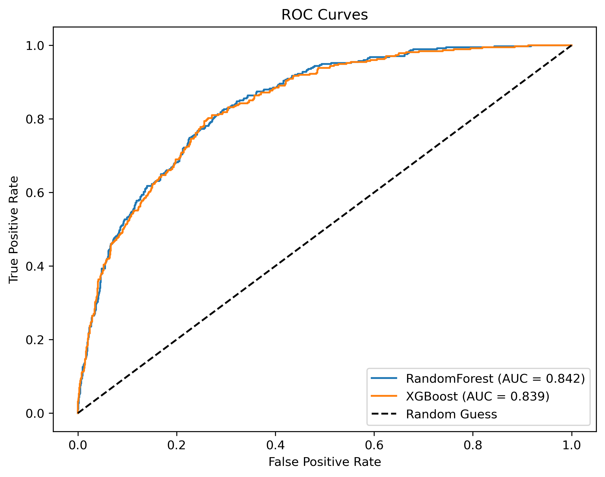
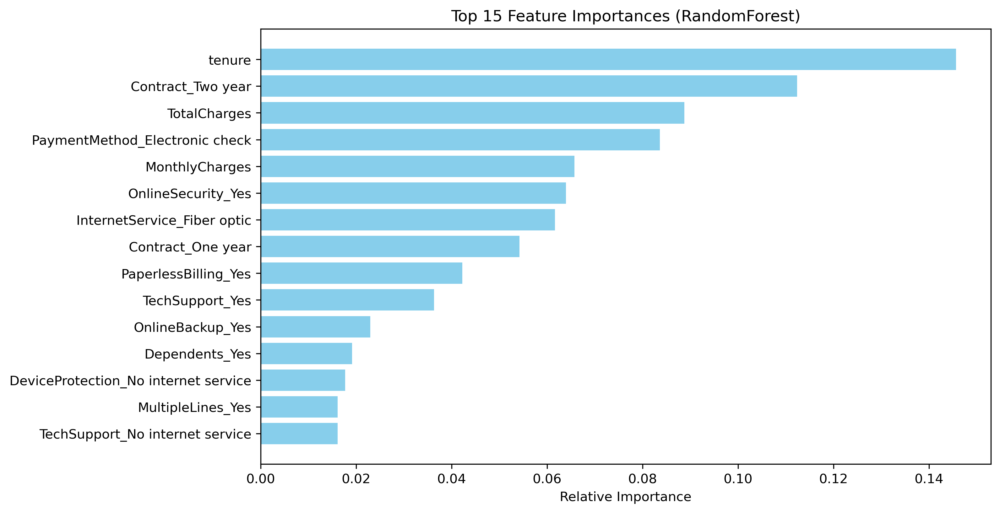

<div align="center">
  <h1>🚀 Telco Customer Churn Prediction Pipeline</h1>
  <p><strong>State-of-the-art Machine Learning classification predicting customer retention.</strong></p>

  
  
  
  

</div>

---

## 📋 Overview
Customer churn is a critical metric for telecom providers. Retaining existing customers is significantly more cost-effective than acquiring new ones. This repository implements an end-to-end, highly optimized machine learning pipeline to preprocess customer data, mitigate class imbalances, and tune multiple advanced models to predict churn with high confidence.

By leveraging **XGBoost**, **Random Forest**, **SMOTE**, and robust **One-Hot Encoding**, this pipeline automatically evaluates and selects the optimal model, currently achieving a highly competitive **ROC-AUC Score of 0.8425**.

---

## 🔬 Key Machine Learning Features

Our pipeline doesn't just train a basic model; it incorporates industry-standard data science techniques directly into the workflow:

*   🔄 **Class Imbalance Handling**: Utilizes **SMOTE** (Synthetic Minority Over-sampling Technique) to artificially generate minority class instances, vastly improving recall for churned customers.
*   🧮 **Advanced Feature Engineering**: 
    *   **Selective Scaling**: Continuous variables are dynamically standard-scaled to ensure equal variance.
    *   **One-Hot Encoding**: Nominal categorical variables are encoded via scikit-learn's `ColumnTransformer` to prevent ordinal bias.
*   ⚙️ **Hyperparameter Tuning**: Uses `RandomizedSearchCV` across a wide grid of parameters to squeeze every drop of performance out of our estimators.
*   🤖 **Multi-Model Evaluation**: Concurrently evaluates both **Random Forest** and **XGBoost** algorithms, automatically picking the champion based on ROC-AUC scoring.

---

## 📊 Model Performance & Visualizations

The pipeline generates high-quality insights straight out of the box, directly visible right here.

### 1. ROC-AUC Curves
Comparing the True Positive Rate against the False Positive Rate. Our tuned Random Forest edges out XGBoost slightly, achieving a stellar `0.8425` AUC.

<p align="center">
  
</p>

### 2. Feature Importance
What actually drives customer churn? Our model extracts the top 15 features contributing to customer decisions. Contract types and tenure duration heavily influence retention!

<p align="center">
  
</p>

### 3. Confusion Matrix
A detailed look at the classification accuracy. Thanks to SMOTE, the pipeline successfully flags the majority of actual churn events, minimizing costly false negatives.

<p align="center">
  
</p>

---

## 🚀 Getting Started

### 1. Clone & Install
Ensure you have Python 3.8+ installed. 
```bash
git clone https://github.com/jonah-002/telco-customer-churn-prediction.git
cd telco-customer-churn-prediction
pip install -r requirements.txt
```

### 2. Prepare the Data
Download the dataset from [Kaggle](https://www.kaggle.com/datasets/blastchar/telco-customer-churn) and place it in the `data/` folder: `data/Telco-Customer-Churn.csv`.

### 3. Run the Pipeline
Execute the master script to trigger the full pipeline (cleaning, SMOTE, hyperparameter tuning, model comparison, and graph generation):
```bash
python train.py
```
