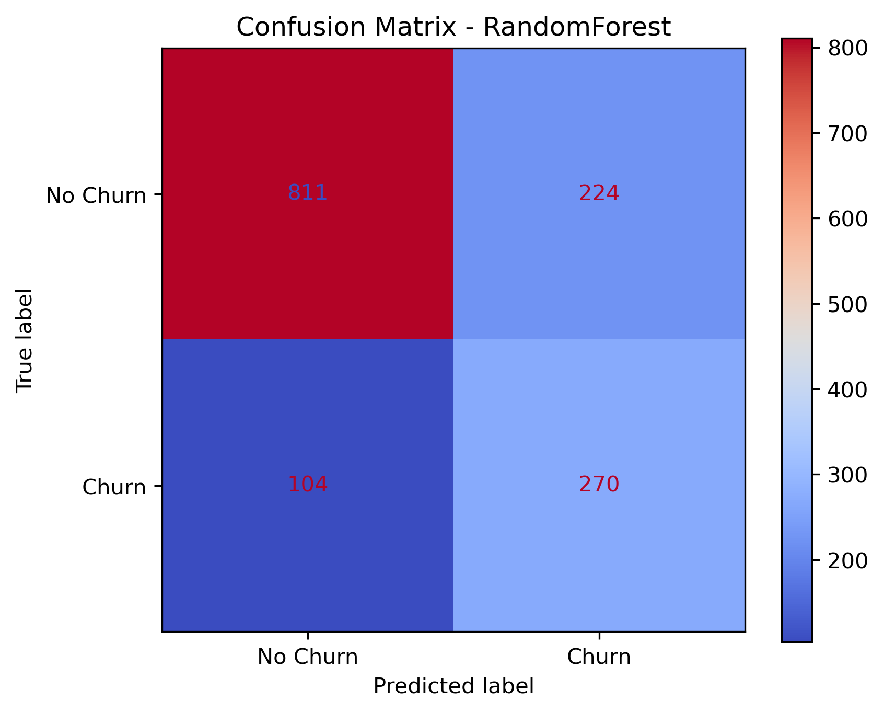

# Telco Customer Churn Prediction

Predicting telecom customer churn using machine learning classifiers built on Scikit-Learn.

---

## 📋 Overview
Customer churn is one of the most critical metrics for telecom providers. Retaining existing customers is significantly more cost-effective than acquiring new ones. This repository implements an end-to-end machine learning pipeline to preprocess customer data, perform exploratory data analysis, and train and tune multiple models (Random Forest and XGBoost) to predict churn.

The project incorporates best practices like **One-Hot Encoding**, **Selective Feature Scaling**, and **SMOTE** (Synthetic Minority Over-sampling Technique) to address class imbalance. Using `RandomizedSearchCV`, the pipeline automatically finds the best hyperparameters, achieving high predictive power with robust ROC-AUC scores.

---

## 📁 Repository Structure
```bash
├── data/
│   └── Telco-Customer-Churn.csv   # Dataset (to be placed here)
├── images/
│   ├── confusion_matrix.png       # Saved confusion matrix evaluation plot
│   ├── roc_curves.png             # Saved ROC curves plot
│   └── feature_importance.png     # Saved top 15 feature importances plot
├── churn_prediction_notebook.ipynb # Interactive Jupyter Notebook analysis
├── generate_pivot.py               # Generates markdown pivot tables of churn rate
├── churn_rate_pivot_table.md       # Exported pivot table
├── train.py                        # Clean, modular training script
├── requirements.txt                # Project dependencies
└── .gitignore                      # Git exclusion rules
```

---

## 🛠️ Setup & Installation

### 1. Clone the Repository
```bash
git clone https://github.com/jonah-002/telco-customer-churn-prediction.git
cd telco-customer-churn-prediction
```

### 2. Install Dependencies
Ensure you have Python 3.8+ installed. Install the required libraries via `pip`:
```bash
pip install -r requirements.txt
```

### 3. Place the Dataset
Download the dataset from [Kaggle (Telco Customer Churn)](https://www.kaggle.com/datasets/blastchar/telco-customer-churn) and place the CSV in the `data/` folder:
* **Destination path**: `data/Telco-Customer-Churn.csv`

---

## 🚀 How to Run

### Run the Modular Script
Execute the main training script to clean the data, train the Random Forest Classifier, and generate validation charts:
```bash
python train.py
```
This script will output accuracy scores directly to your console and output a confusion matrix plot under the `images/` directory.

### Run the Interactive Notebook
To interactively explore the data step-by-step:
```bash
jupyter notebook churn_prediction_notebook.ipynb
```

---

## 📊 Dataset Features
The dataset contains information about **7,043** customers across 21 columns. The primary target is **Churn** (whether the customer left within the last month).

Key feature groups:
* **Demographics**: `gender`, `SeniorCitizen`, `Partner`, `Dependents`.
* **Services Signed Up**: `PhoneService`, `MultipleLines`, `InternetService`, `OnlineSecurity`, `OnlineBackup`, `DeviceProtection`, `TechSupport`, `StreamingTV`, `StreamingMovies`.
* **Account Info**: `tenure`, `Contract`, `PaperlessBilling`, `PaymentMethod`, `MonthlyCharges`, `TotalCharges`.

---

## 📈 Preprocessing and Modeling Pipeline
1. **Numeric Coercion**: Convert `TotalCharges` to float, coercing empty spaces to `NaN`.
2. **Imputation**: Missing values in `TotalCharges` are filled with the column's median.
3. **Column Transformation**: 
   - **Continuous features** (`tenure`, `MonthlyCharges`, `TotalCharges`) are standard-scaled.
   - **Categorical features** are transformed using `OneHotEncoder`.
4. **Data Splitting**: Split into 80% training / 20% test partitions.
5. **Class Imbalance Management**: The training pipeline incorporates **SMOTE** (via `imblearn`) to artificially balance the minority class (Churn=Yes) during training.
6. **Training & Tuning**: Uses `RandomizedSearchCV` to optimize both a `RandomForestClassifier` and an `XGBClassifier`.
7. **Evaluation**: Compares models based on ROC-AUC scores, plots ROC curves, confusion matrix, and feature importances for the best model.

---

## 📌 Model Evaluation Results
Upon running the training pipeline, the script outputs the performance (Accuracy, Classification Report, and ROC-AUC score) for both tuned models and saves visualizations:
* **Confusion Matrix**: Visualizes True/False Positives and Negatives.
* **ROC Curve**: Compares the True Positive Rate against the False Positive Rate.
* **Feature Importance**: Highlights the top 15 most important factors driving customer churn.



---

## 💡 Recent Enhancements
* ✅ **One-Hot Encoding**: Replaced ordinal LabelEncoding with robust OneHotEncoding.
* ✅ **Class Imbalance Management**: Implemented SMOTE oversampling.
* ✅ **Selective Scaling**: Only continuous columns are standard scaled now.
* ✅ **Hyperparameter Tuning**: Integrated `RandomizedSearchCV` for Random Forest and XGBoost to automatically select the best model.
* ✅ **Pivot Table Generation**: Added `generate_pivot.py` to extract insights on Churn rate by Contract and Internet Service.
